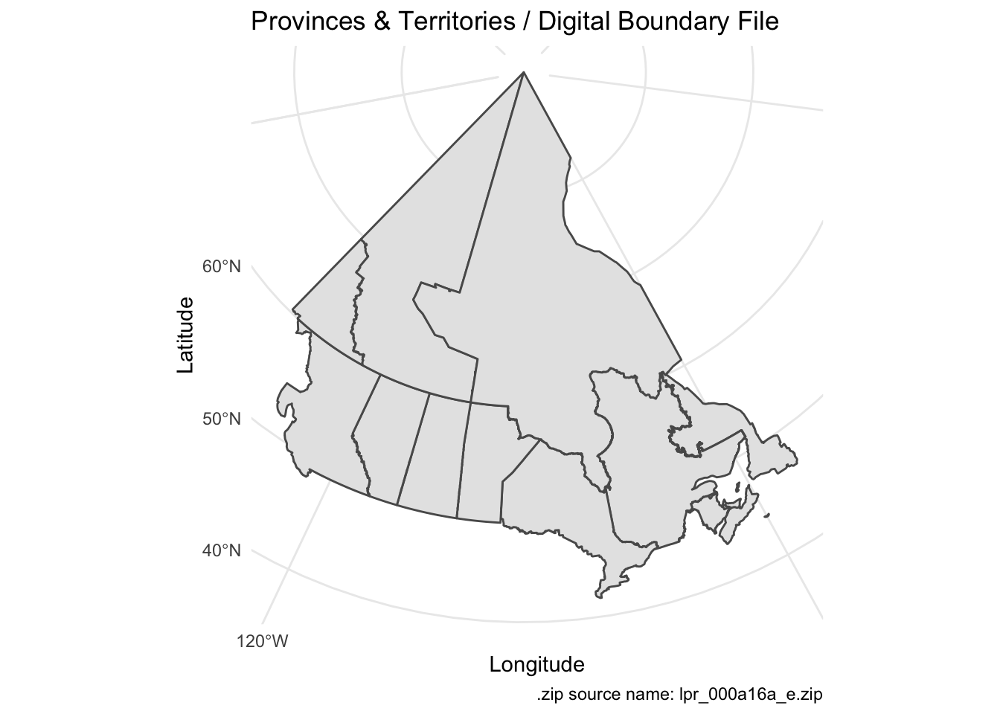

<!-- README.md is generated from README.Rmd. Please edit that file -->

# canmap

<!-- badges: start -->

<!-- badges: end -->

`canmap` provides easy access to standard Canadian geographic
shapefiles, as well as the associated metadata that helps pick which one
you’d like. It’s named after mapbox, but instead of a box it’s a can.
Except mapcan was already taken on CRAN.

## Installation

You can install the external development version of `canmap` with:

``` r
remotes::install_github("tweed1e/canmap")
```

And you can install the internal development version of `canmap` with:

``` r
remotes::install_gitlab("tweejes/canmap", host = "gitlab.statcan.ca")
```

## Example

``` r

library(tidyverse)
#> ── Attaching packages ──────────────────────────────────────────────────────────── tidyverse 1.3.0 ──
#> ✓ ggplot2 3.3.0     ✓ purrr   0.3.3
#> ✓ tibble  2.1.3     ✓ dplyr   0.8.4
#> ✓ tidyr   1.0.2     ✓ stringr 1.4.0
#> ✓ readr   1.3.1     ✓ forcats 0.5.0
#> ── Conflicts ─────────────────────────────────────────────────────────────── tidyverse_conflicts() ──
#> x dplyr::filter() masks stats::filter()
#> x dplyr::lag()    masks stats::lag()
library(canmap)

default_shp <- shapefile_paths %>%
  filter(
    geo_code == "pr_" &
    file_type == "digital boundary file" &
    format == "ArcGIS (.shp)" &
    language == "english"  &
    ref_date == 2016 &
    projection == "projection in Lambert conformal conic"
  )

default_shp
#> # A tibble: 1 x 10
#>   filepath size  path  ref_date geo_code geo_level file_type format projection
#>   <chr>    <chr> <chr>    <dbl> <chr>    <chr>     <chr>     <chr>  <chr>     
#> 1 lpr_000… 1.31M http…     2016 pr_      province… digital … ArcGI… projectio…
#> # … with 1 more variable: language <chr>

# then pick a shapefile and get the link:
(url <- default_shp[1, ]$path)
#> [1] "http://www12.statcan.gc.ca/census-recensement/2011/geo/bound-limit/files-fichiers/2016/lpr_000a16a_e.zip"

# then you can download it yourself, or use download_geography(url)

(shp_path <- download_geography(url))
#> lpr_000a16a_e.zip already downloaded, returning filepath to unzipped .shp.
#> [1] "/Users/jessetweedle/Documents/github/canmap/geography/lpr_000a16a_e/lpr_000a16a_e.shp"

(provinces <- sf::read_sf(shp_path))
#> Simple feature collection with 13 features and 6 fields
#> geometry type:  MULTIPOLYGON
#> dimension:      XY
#> bbox:           xmin: 3658201 ymin: 658873 xmax: 9019157 ymax: 6083005
#> epsg (SRID):    3347
#> proj4string:    +proj=lcc +lat_1=49 +lat_2=77 +lat_0=63.390675 +lon_0=-91.86666666666666 +x_0=6200000 +y_0=3000000 +ellps=GRS80 +towgs84=0,0,0,0,0,0,0 +units=m +no_defs
#> # A tibble: 13 x 7
#>    PRUID PRNAME    PRENAME  PRFNAME  PREABBR PRFABBR                    geometry
#>    <chr> <chr>     <chr>    <chr>    <chr>   <chr>            <MULTIPOLYGON [m]>
#>  1 10    Newfound… Newfoun… Terre-N… N.L.    T.-N.-… (((7644465 2980078, 764886…
#>  2 11    Prince E… Prince … Île-du-… P.E.I.  Î.-P.-… (((8427185 1638777, 842717…
#>  3 12    Nova Sco… Nova Sc… Nouvell… N.S.    N.-É.   (((8525489 1790548, 852563…
#>  4 13    New Brun… New Bru… Nouveau… N.B.    N.-B.   (((8188458 1707920, 818844…
#>  5 24    Quebec /… Quebec   Québec   Que.    Qc      (((7143607 3010209, 714985…
#>  6 35    Ontario   Ontario  Ontario  Ont.    Ont.    (((6378816 2295412, 637874…
#>  7 46    Manitoba  Manitoba Manitoba Man.    Man.    (((6039657 2636304, 603962…
#>  8 47    Saskatch… Saskatc… Saskatc… Sask.   Sask.   (((5248634 2767057, 524928…
#>  9 48    Alberta   Alberta  Alberta  Alta.   Alb.    (((5228304 2767598, 522809…
#> 10 59    British … British… Colombi… B.C.    C.-B.   (((4018904 3410247, 401943…
#> 11 60    Yukon     Yukon    Yukon    Y.T.    Yn      (((4561932 4312865, 456400…
#> 12 61    Northwes… Northwe… Territo… N.W.T.  T.N.-O. (((5689672 4324508, 568549…
#> 13 62    Nunavut   Nunavut  Nunavut  Nvt.    Nt      (((7297737 3983558, 731665…
```

Then input into ggplot + sf:

``` r
ggplot() +
  geom_sf(data = provinces) +
  labs(title = "Provinces & Territories / Digital Boundary File", 
       x = "Longitude", y = "Latitude",
       caption = paste0("Source: ", url))
```



## Documentation

A list of useful links to clean up later:

  - [Geography definitions and
    documentation](https://www.statcan.gc.ca/eng/subjects/standard/sgc/geography)
  - [Root for geography downloads and
    documentation](https://www12.statcan.gc.ca/census-recensement/2016/geo/index-eng.cfm)
  - [Direct link to download directory for 2016
    shapefiles](https://www12.statcan.gc.ca/census-recensement/2011/geo/bound-limit/bound-limit-2016-eng.cfm)
  - [Heirarchy of
    geography](https://www150.statcan.gc.ca/n1/pub/92-195-x/2011001/other-autre/hierarch/h-eng.htm)

### Parsing the filename for metadata

Suppose you’ve downloaded the geography file `lpr_000a16a_e.zip`. The
filename defines the important geographic characteristics of the file
(you can process using the `code_pos` dataset for code positions, or
`geo_info`).

``` r
str(geo_info("lpr_000a16a_e"))
#> Classes 'tbl_df', 'tbl' and 'data.frame':    1 obs. of  8 variables:
#>  $ filename  : chr "lpr_000a16a_e"
#>  $ ref_date  : chr "2016"
#>  $ geo_code  : chr "pr_"
#>  $ geo_level : chr "province and territory"
#>  $ file_type : chr "digital boundary file"
#>  $ format    : chr "ArcGIS (.shp)"
#>  $ projection: chr "projection in Lambert conformal conic"
#>  $ language  : chr "english"
```

And each of these codes has a meaning that can be found (sometimes) in
the geography guide that accompanies a downloaded file (but you can’t
find out the details until *after* you’ve downloaded it, and is missing
some information).

Your first default parameters should be:

  - `file_type == "a"` (digital boundary file—it doesn’t look as good
    but it’s smaller)
  - `format == "a"` (ArcGIS/ArcInfo®/.shp—for use with `sf` and other
    `R` geographic packages)
  - `geo_coverage == "000"` (Canada—the only option AFAIK)
  - `projection == "g"` (geographic projection/lat-long—this makes it
    less likely for the user to get caught up in coordinate reference
    systems \[CRS\] conversion issues)

The most important choices for the user are: year (2016 is the latest
census year currently available), language (english or french) and
geo\_code/geo\_level. A list of geo codes and geo levels are given in
the `code_book` dataset:

``` r
dplyr::filter(code_book, code_type == "geo_level")
#> # A tibble: 34 x 3
#>    code_type code  code_desc                                        
#>    <chr>     <chr> <chr>                                            
#>  1 geo_level pr_   province and territory                           
#>  2 geo_level cd_   census division                                  
#>  3 geo_level ccs   census consolidated subdivision                  
#>  4 geo_level csd   census subdivision                               
#>  5 geo_level er_   economic region                                  
#>  6 geo_level cma   census metropolitan area and census agglomeration
#>  7 geo_level fed   federal electoral district                       
#>  8 geo_level ct_   census tract                                     
#>  9 geo_level dpl   designated place                                 
#> 10 geo_level pc_   population centre                                
#> # … with 24 more rows
```

Business data usually isn’t released below the economic region level
(`er_`), while census data can go down to census tract (`ct_`),
dissemination area (`da_`) or dissemination block (`db_`).

English and french maps are in different files, so they have different
codes: `lpr_000a16a_e.zip` has the english province/territory maps and
`lpr_000a16a_f.zip` has the french province/territory maps. The only
difference, AFAIK, is that the guide and geography names are in french
in the french version.

## Notes

Please note that the ‘canmap’ project is released with a [Contributor
Code of Conduct](.github/CODE_OF_CONDUCT.md). By contributing to this
project, you agree to abide by its terms.
